<div align="center">
  
</div>

# KAA - Kotlin Async/Await

A lightweight Kotlin library that brings async/await syntax to Java's CompletableFuture, leveraging Java 21's virtual threads for efficient concurrent programming.

## Overview

KAA provides a clean async/await API that simplifies asynchronous programming in Kotlin by eliminating callback hell and making concurrent code more readable and maintainable. It builds on top of Java's CompletableFuture and utilizes virtual threads for optimal performance.

## Features

- **Clean Syntax**: Write asynchronous code that looks and feels synchronous
- **Virtual Thread Support**: Leverages Java 21+ virtual threads for efficient concurrency
- **CompletableFuture Integration**: Seamlessly works with existing CompletableFuture-based code
- **Thread Safety**: Built with proper synchronization using ReentrantLock and condition variables
- **Recursive Support**: Handles deep async call stacks without stack overflow
- **Exception Handling**: Proper exception propagation from async operations

## Requirements

- Java 21 or higher (for virtual thread support)

## Quick Start

### Basic Usage

```kotlin
import KAA.Companion.async
import KAA.Companion.await

// Traditional CompletableFuture approach
val traditionalFuture = CompletableFuture.supplyAsync { findUserIds() }
    .thenCompose { ids ->
        val futures = ids.map { CompletableFuture.supplyAsync { fetchUserName(it) } }
        CompletableFuture.allOf(*futures.toTypedArray())
            .thenApply { futures.map { it.join() } }
    }

// KAA async/await approach
val cleanFuture = async {
    val userIds = await(async { findUserIds() })
    val userNames = userIds.map { id -> await(async { fetchUserName(id) }) }
    userNames
}
```

### Concurrent Operations

```kotlin
// Execute multiple async operations concurrently
val result = async {
    val futures = (1..10).map { id -> async { fetchUserData(id) } }
    futures.map(::await) // Wait for all to complete
}
```

### Mixed I/O and CPU Operations

```kotlin
val processedData = async {
    // I/O operation
    val rawData = await(async { fetchDataFromAPI() })
    
    // CPU-intensive operation on a thread pool
    val processed = rawData.map { data ->
        CompletableFuture.supplyAsync({ processData(data) }, cpuExecutor)
    }
    
    // Await all processing
    processed.map(::await)
}
```

## API Reference

### `async(fn: Callable<A>): CompletableFuture<A>`

Creates an asynchronous operation that runs on a virtual thread.

- **Parameters**: `fn` - A callable that contains the async code
- **Returns**: CompletableFuture that will complete with the result
- **Thread**: Always runs on a new virtual thread

### `await(cf: CompletableFuture<A>): A`

Waits for a CompletableFuture to complete and returns its result.

- **Parameters**: `cf` - CompletableFuture to wait for
- **Returns**: The result of the CompletableFuture
- **Throws**: `IllegalStateException` if not called within an `async` block
- **Requirements**: Must be called from a virtual thread

## How It Works

KAA uses Java's `ScopedValue` to maintain async context and virtual threads for efficient blocking operations. When you call `await()`:

1. The library verifies you're in a virtual thread within an async context
2. Uses a ReentrantLock and condition variable to park the current virtual thread
3. Registers a completion handler that signals the condition when the future completes
4. Returns the result once the future is completed

This approach allows virtual threads to be parked efficiently without blocking OS threads, enabling massive concurrency.

## Performance Characteristics

- **Virtual Thread Based**: Scales to millions of concurrent operations
- **Low Memory Overhead**: Virtual threads use stack-on-demand allocation
- **No Thread Pool Management**: Virtual threads are managed by the JVM
- **Efficient Blocking**: Virtual threads park instead of blocking OS threads

## Examples

### Database + API + CPU-bond operation

```kotlin
val future = async {
    val userIds = async { findUserIds() }
    val userNames = await(userIds).map { id -> async { fetchUserName(id) } }
    userNames.map {
        val name = await(it)
        CompletableFuture.supplyAsync({ encryptUserName(name) }, TP_EXECUTOR)
    }.joinToString { await(it) }
}
```

## Limitations

- Requires Java 21+ for virtual thread support
- `await()` can only be called within `async{}` blocks
- Must be called from virtual threads (enforced at runtime)
